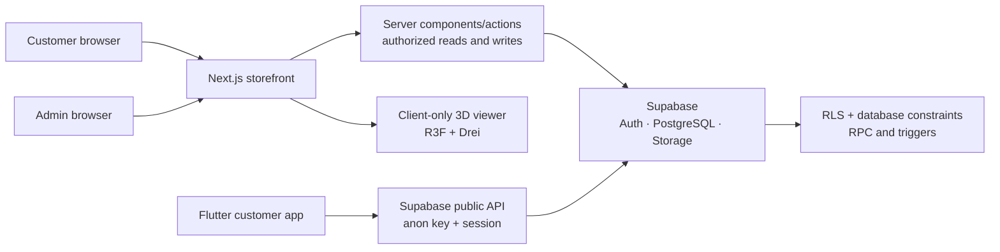

# SneakerLab

> A secure, full-stack sneaker commerce portfolio with an interactive 3D product experience on web and mobile.

SneakerLab is a deliberately small but production-minded commerce system. Customers can discover generic sneaker products, save favorites, manage a cart, place a **demo-only** checkout, inspect orders, and explore a supported product in 3D. A role-protected admin dashboard and Flutter customer application share one Supabase backend.

## What it demonstrates

- A responsive Next.js App Router storefront with server-rendered catalog queries, URL-backed filters, pagination, product variants, favorites, cart, and order history.
- A client-only React Three Fiber / Drei glTF preview with orbit controls, touch/pinch support, reset, reduced-motion behavior, loading state, and image fallback.
- A Flutter Material 3 app with Supabase auth/session recovery, catalog, favorites, persistent cart, demo checkout, orders, account flow, and touch-based glTF viewing for supported devices.
- A secure Supabase foundation: ordered migrations, constraints, RLS, storage policies, server-calculated checkout RPC, immutable order snapshots, and pgTAP coverage.
- A server-authorized admin dashboard for products, categories, variants, images, GLB/glTF media, and allowed order-status changes.
- Real automated quality gates for TypeScript, web components, production builds, Flutter, database policies, and browser journeys. Results are recorded truthfully in the [test report](docs/TEST_REPORT.md).

## Stack

| Area    | Technology                                                                        |
| ------- | --------------------------------------------------------------------------------- |
| Web     | Next.js App Router, React, TypeScript, Tailwind CSS, React Hook Form, Zod         |
| 3D web  | Three.js, React Three Fiber, Drei, GLB/glTF                                       |
| Mobile  | Flutter, Material 3, Riverpod, GoRouter, Supabase Flutter, `model_viewer_plus`    |
| Backend | Supabase Auth, PostgreSQL, Storage, Row Level Security, SQL migrations, pgTAP     |
| Quality | Vitest, React Testing Library, Playwright, Flutter test/analyze, ESLint, Prettier |

## Architecture



More detailed system, authentication, customer-flow, admin-flow, and ERD diagrams live in [docs/ARCHITECTURE.md](docs/ARCHITECTURE.md).

## Repository layout

```text
apps/web/              Next.js storefront, admin dashboard, web 3D viewer, browser tests
apps/mobile/           Flutter customer application and mobile 3D viewer
packages/shared-types/ Cross-platform TypeScript domain contracts
supabase/              Migrations, RLS/storage policies, deterministic seed, pgTAP tests
docs/                  Architecture, deployment, progress, truthful reports, capture checklist
```

## Local setup

Prerequisites: Node.js 22+, pnpm 11+, Flutter stable, Docker Desktop, and Supabase CLI.

1. Install web workspace dependencies.

   ```bash
   pnpm install --frozen-lockfile
   ```

2. Copy `.env.example` to `apps/web/.env.local`, then set only the Supabase project URL and anonymous key. Never place a service-role key in a browser or Flutter build.

3. Start and seed the local Supabase project.

   ```bash
   pnpm exec supabase start
   pnpm exec supabase db reset
   pnpm exec supabase test db
   ```

4. Start the web app.

   ```bash
   pnpm dev:web
   ```

5. Prepare and run the Flutter app.

   ```bash
   cd apps/mobile
   flutter pub get
   flutter analyze
   flutter test
   flutter run --dart-define=SUPABASE_URL=... --dart-define=SUPABASE_ANON_KEY=...
   ```

`model_viewer_plus` uses the standards-based `<model-viewer>` renderer. Android and iOS runners are included, including the local-only Android network exception required for the bundled model asset. The built-in generic Pulse Layer model is a local asset; hosted product models must be HTTPS. See [deployment guidance](docs/DEPLOYMENT.md#flutter-release-configuration) before a device or release build.

## Quality commands

```bash
pnpm lint
pnpm typecheck
pnpm test
pnpm build
pnpm test:e2e
pnpm secret:scan
pnpm format:check

cd apps/mobile
flutter pub get
flutter analyze
flutter test
```

The browser suite contains 16 end-to-end journeys. Database tests require the local Supabase/Docker service. See [docs/TEST_REPORT.md](docs/TEST_REPORT.md) for which commands actually passed, were user-run, or are blocked by the Codex sandbox.

## Deployment

No production deployment is performed by this repository. The deployment guide covers:

- linking a hosted Supabase project, applying migrations, seeding only intentional demo data, configuring Storage, and assigning admin roles through a privileged workflow;
- Vercel environment variables with the service-role key server-only;
- Flutter Android/iOS renderer and release configuration;
- a post-deploy smoke-test and security checklist.

Read [docs/DEPLOYMENT.md](docs/DEPLOYMENT.md) before creating any hosted resource.

## Screenshots

No screenshots are fabricated. Capture a real web/mobile/admin run using the checklist in [docs/screenshots/README.md](docs/screenshots/README.md).

## Limits and roadmap

- Checkout is intentionally demo-only; it never charges a payment method.
- One generic local glTF model demonstrates the interaction path. Real merchandising needs optimized, licensed GLB/glTF assets and CDN delivery.
- The mobile viewer’s WebView-based renderer uses a poster/image fallback when a model cannot render; device and OS testing remains required.
- Browser E2E and Docker-backed database checks must run in a normal local terminal when sandbox process/port restrictions apply.

Useful next work: payment-provider integration, transactional email, image/model optimization pipeline, analytics, accessibility review with real assistive technology, and a staging deployment.
