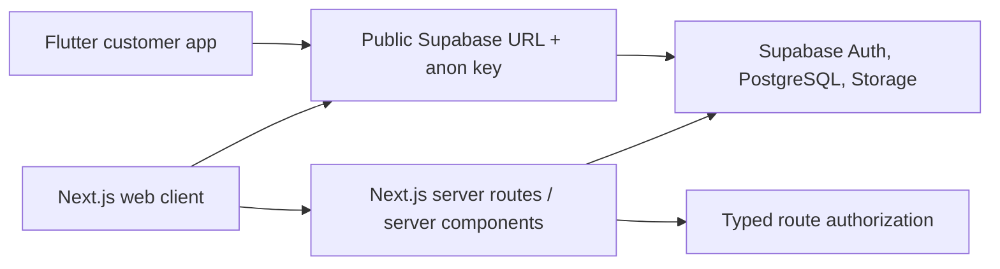
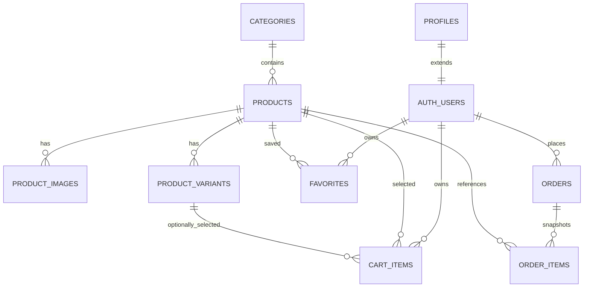

# SneakerLab Architecture

## Phase 1 overview

SneakerLab is a pnpm workspace with a Next.js App Router application, a Flutter application, shared TypeScript domain contracts, and a Supabase directory reserved for migrations, seed data, and database tests. The current web UI is intentionally a shell: it does not require a Supabase project to render or test basic paths.



## Authentication and authorization

- Browser authentication uses the anonymous-key Supabase client through a typed repository and service abstraction. This lets component tests use an in-memory fake rather than a live service.
- Server-side protected pages resolve the authenticated user with the server client and make a typed decision for `account` or `admin` access. A proxy refreshes Supabase session cookies when the public configuration is available.
- The server-only service-role key is not read by client code and is not required for the Phase 1 customer-facing runtime.
- Phase 2 will add the `profiles` table and RLS-backed role lookup. Phase 1 uses a typed role boundary that safely treats unavailable role data as non-admin.

## Folder structure

```text
apps/web/src/app/        Route components and route-level fallbacks
apps/web/src/components/ Reusable UI and auth components
apps/web/src/lib/        Environment, Supabase, auth, and shared utilities
apps/mobile/lib/         Flutter app, core config, routing, and auth feature
packages/shared-types/   Shared TypeScript role and catalog contracts
supabase/migrations/     Ordered SQL migrations (Phase 2 onward)
supabase/tests/          Database and security tests (Phase 2 onward)
```

## Data flow

Phase 2 provides Supabase schema, RLS, storage policies, deterministic seed data, and generated-type-compatible contracts. Phase 3 onward uses typed repositories instead of scattering raw Supabase queries across UI components.

## Phase 2 data and security model

The database is the authority for prices, stock, roles, and orders. Customer clients can read public active catalog data and manage only their own profile, favorites, cart, and order history. They cannot insert an order or its items directly: `create_order_from_cart` derives the caller from `auth.uid()`, locks cart/catalog rows, calculates prices from the database, validates stock, writes immutable snapshots, decrements one consistent stock source, and clears the cart atomically.



`public.is_admin()` is a security-definer helper that checks the current authenticated profile without recursive RLS. Profile role changes are blocked by a database trigger unless performed by an administrator or database owner. Storage similarly limits product assets to admins and avatars to the owning user UUID path.
