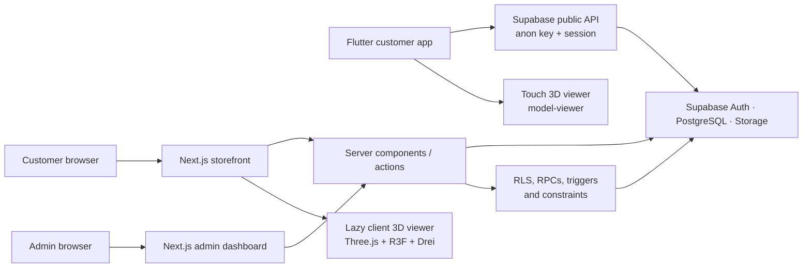
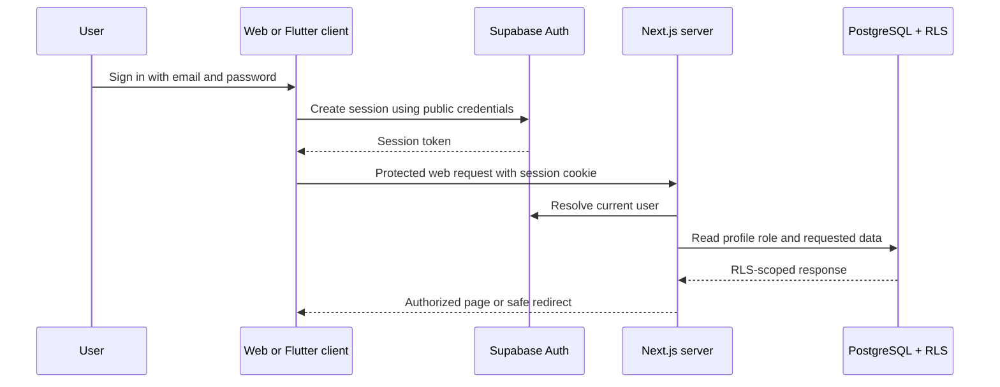
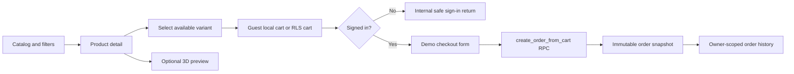
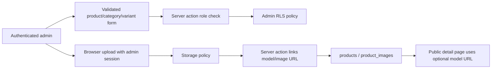
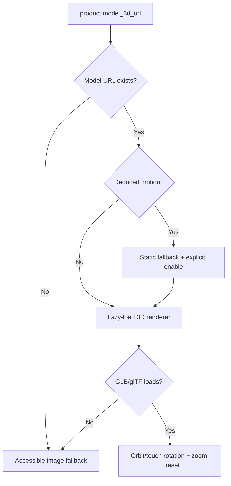
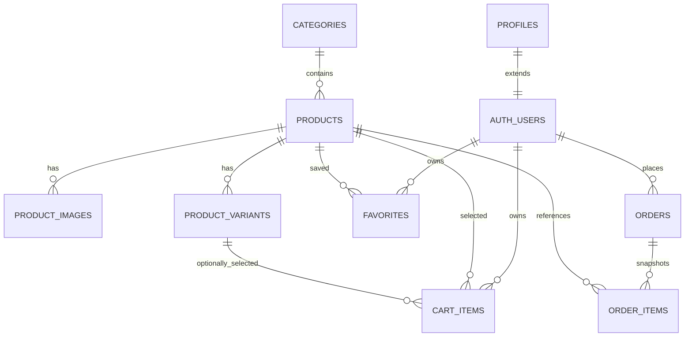

# SneakerLab Architecture

## System overview

SneakerLab is a pnpm workspace with a Next.js web application, Flutter customer app, shared TypeScript contracts, and a Supabase backend. The web application keeps privileged authorization decisions on the server. Browser and mobile applications use only the Supabase public URL, anonymous key, and their authenticated session.

## Authentication and authorization

- Customer code never reads a service-role key or supplies a trusted user ID for owner-scoped data.
- Every web admin route checks the session and profile role in the server layout and again in each server action.
- PostgreSQL RLS is the final authority: a customer cannot bypass UI checks to write catalog data, another profile, favorites, cart items, or orders.
- `create_order_from_cart` resolves `auth.uid()`, derives price and stock from database rows, locks the relevant rows, writes snapshots, and clears the cart atomically.

## Customer commerce flow

Guest-cart prices are display-only. The checkout RPC uses the current database price and validates stock just before order creation. Variant items decrement variant stock; non-variant items decrement product stock, never both.

## Admin media and catalog flow

Images accept JPEG, PNG, or WebP up to 5 MB. GLB/glTF model uploads accept up to 20 MB and are stored separately. The admin screen allows a model to be replaced or unlinked; it does not expose a service-role credential.

## 3D rendering behavior

The web canvas is dynamically imported with SSR disabled, uses constrained orbit zoom and low-power rendering, and is isolated by an error boundary. The Flutter viewer accepts the bundled local example or HTTPS model URLs; it uses an image poster and leaves the product gallery usable if rendering is unavailable.

## Data model

See [supabase/README.md](../supabase/README.md) for local migration, type-generation, and safe admin-assignment workflows.
