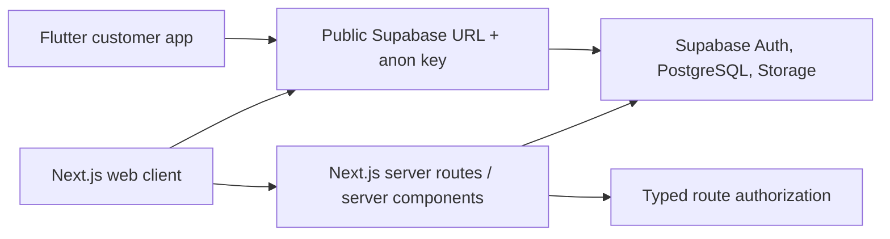
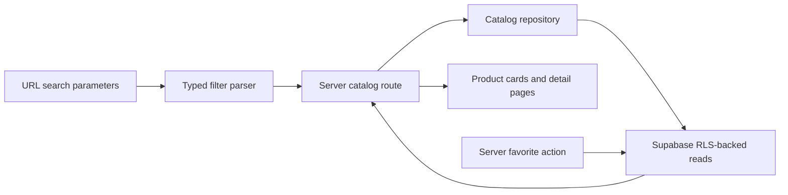
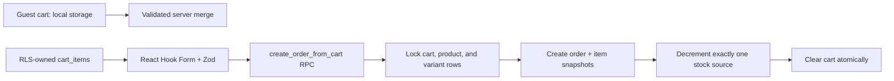
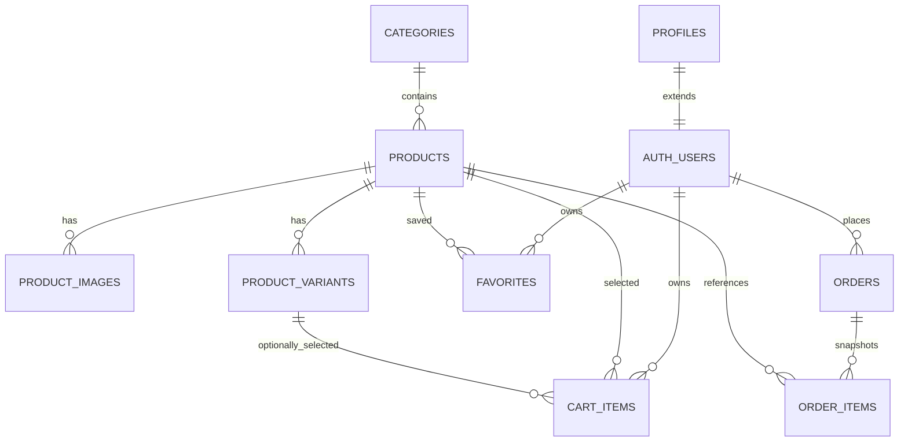

# SneakerLab Architecture

## Current overview

SneakerLab is a pnpm workspace with a Next.js App Router application, a Flutter application, shared TypeScript domain contracts, and a Supabase directory with migrations, seed data, and database tests. The web storefront uses server-rendered, typed catalog reads when public Supabase configuration is available and renders a safe configuration state otherwise.



## Authentication and authorization

- Browser authentication uses the anonymous-key Supabase client through a typed repository and service abstraction. This lets component tests use an in-memory fake rather than a live service.
- Server-side protected pages resolve the authenticated user with the server client and make a typed decision for `account` or `admin` access. A proxy refreshes Supabase session cookies when the public configuration is available.
- The server-only service-role key is not read by client code and is not required for the Phase 1 customer-facing runtime.
- The `profiles` table and RLS-backed role lookup treat unavailable role data as non-admin. Favorite mutations authenticate on the server and query only the authenticated user's rows; a client never supplies a trusted user ID.

## Folder structure

```text
apps/web/src/app/        Route components and route-level fallbacks
apps/web/src/components/ Reusable UI, catalog, and auth components
apps/web/src/lib/        Environment, Supabase, auth, catalog repositories, and utilities
apps/mobile/lib/         Flutter app, core config, routing, and auth feature
packages/shared-types/   Shared TypeScript role and catalog contracts
supabase/migrations/     Ordered SQL migrations (Phase 2 onward)
supabase/tests/          Database and security tests (Phase 2 onward)
```

## Catalog data flow

Phase 2 provides Supabase schema, RLS, storage policies, deterministic seed data, and generated-type-compatible contracts. Phase 3 centralizes raw catalog queries in `apps/web/src/lib/catalog/catalog-repository.ts`; route components only consume typed products, facets, filters, and favorite IDs.



Every public product query explicitly scopes to active products. Filtering, sorting, and pagination execute in Supabase; the browser receives only the resulting page rather than a complete catalog. Anonymous favorite links preserve an internal, validated continuation path to sign-in.

## Cart, checkout, and order flow

Guest cart lines are stored in browser local storage as identifiers plus display-only snapshots. Their price and availability are never trusted at checkout. After sign-in, the customer is offered a deterministic merge into RLS-owned `cart_items`; each accepted line is rechecked against the active product and selected variant stock.



The checkout RPC derives the customer from `auth.uid()`, derives monetary values from current database prices, and locks rows before checking stock. Variant lines decrement variant stock; non-variant lines decrement product stock, never both. A per-user idempotency UUID is unique on `orders`, so retrying the same checkout returns the original order rather than creating a duplicate. Order lookups always scope to the authenticated owner.

Profile name edits are server-authorized and never expose protected fields. Avatar uploads accept only JPEG/PNG/WebP under 2 MB, write only to the authenticated user's private Storage path, and save only that path in the profile; signed URLs are generated server-side for display.

## Phase 2 data and security model

The database is the authority for prices, stock, roles, and orders. Customer clients can read public active catalog data and manage only their own profile, favorites, cart, and order history. They cannot insert an order or its items directly: `create_order_from_cart` derives the caller from `auth.uid()`, locks cart/catalog rows, calculates prices from the database, validates stock, writes immutable snapshots, decrements one consistent stock source, and clears the cart atomically.



`public.is_admin()` is a security-definer helper that checks the current authenticated profile without recursive RLS. Profile role changes are blocked by a database trigger unless performed by an administrator or database owner. Storage similarly limits product assets to admins and avatars to the owning user UUID path.
